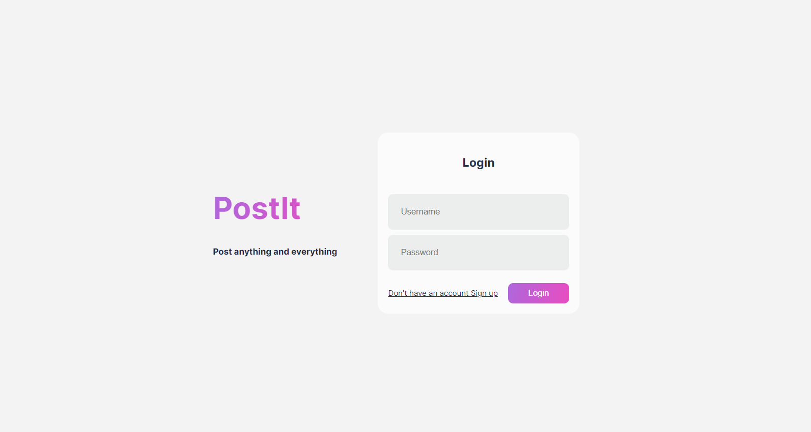
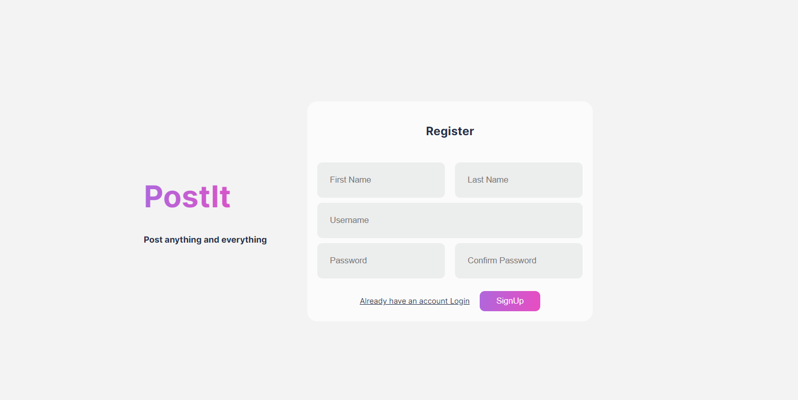
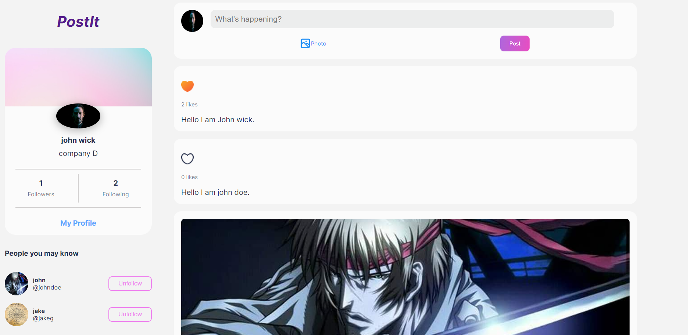
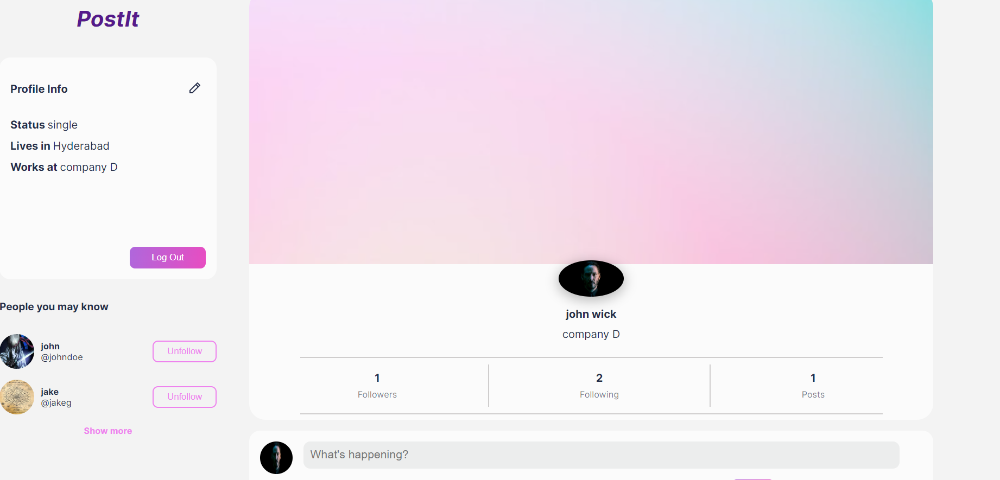
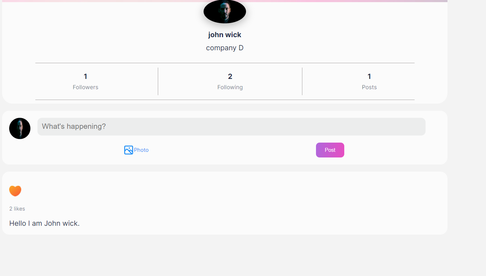

PostIt is a social media application where users can post posts. The web app has authentication system, following, likes, posting posts with images and text, my profile page, home pages, followers list component, about section features implemented in it.

TechStack Used is MERN(MongoDB, Express.js, React.js, Node.js).

